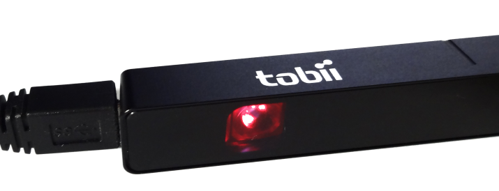

# gaze

Nim bindings for the Tobii Gaze eye tracking SDK.




## About


## Supported Platforms

This package is still under development and does not work yet. The following
platforms have been built and tested:

- ~~Android~~
- ~~Linux~~
- ~~Windows~~


## Prerequisites

### Android

TODO

### Linux

TODO

### Windows

TODO


## Dependencies

This package does not have any dependencies to other Nim packages at this time.


## Usage

Import the *gaze* module from this package to make the bindings available
in your project:

```nimrod
import gaze
```


## Support

Please [file an issue](https://github.com/nimious/gaze/issues), submit a
[pull request](https://github.com/nimious/gaze/pulls?q=is%3Aopen+is%3Apr)
or email us at info@nimio.us if this package is out of date or contains bugs.
For all other issues related to USB devices visit the libusb web site below.


## References

* [Nim Programming Language](http://nim-lang.org/)
